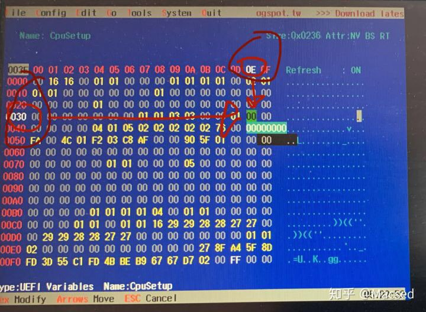
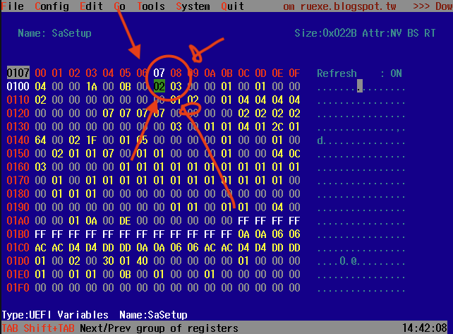
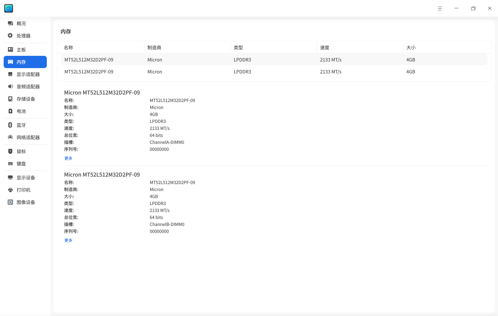
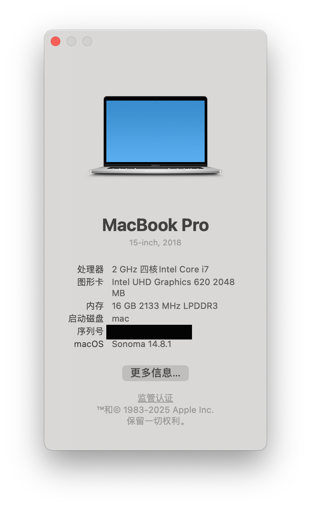
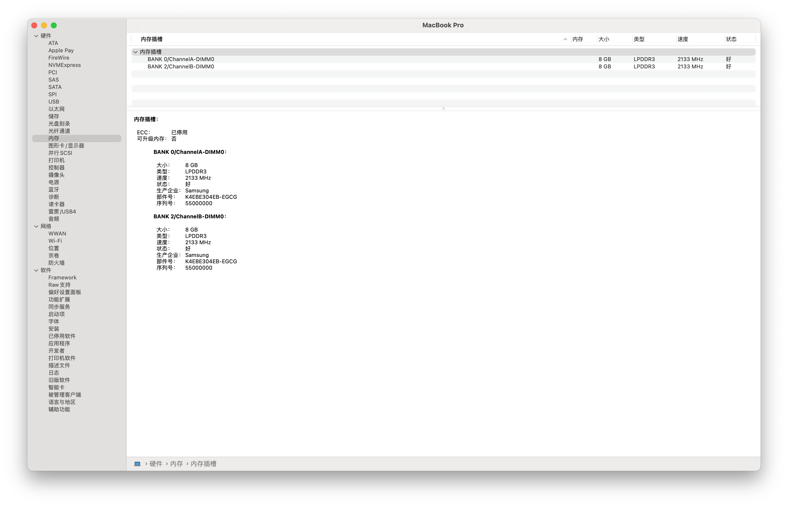

# Huawei MateBook X Pro 2019 OpenCore（Headless / 外接屏）

这是一个基于 OpenCore 的 Huawei MateBook X Pro 2019 黑苹果 EFI 备份，主要面向 **2019 款 MateBook X Pro**，并针对外接显示器安装/启动场景整理。

本仓库 EFI 来自实际安装成功后的配置整理，参考并感谢：

- [demonlj/Matebook-X-Pro-2019-OpenCore](https://github.com/demonlj/Matebook-X-Pro-2019-OpenCore)
- [zeroruka/Matebook-X-Pro-2019-OC](https://github.com/zeroruka/Matebook-X-Pro-2019-OC)
- [profzei/Matebook-X-Pro-2018](https://github.com/profzei/Matebook-X-Pro-2018)

## 当前状态

- OpenCore：1.0.7 core files
- 目标系统：macOS Sonoma 14
- 机器：Huawei MateBook X Pro 2019
- CPU：Intel Whiskey Lake-U（例如 i5-8265U）
- 核显：Intel UHD Graphics 620
- 独显：NVIDIA MX250，已禁用
- 内存：未按 16 GB 改装机处理，配置按普通 8 GB/当前机器风格整理
- 显示：使用 demonlj 正常 HDMI/DP/USB-C 外接屏配置
- 调试：默认开启 verbose/debug 和 OpenCore 文件日志，方便安装阶段排错

已验证：

- 可进入 OpenCore
- 可安装并启动 macOS
- APFS 系统分区可从 OpenCore 引导
- 外接显示器安装路径可用

## 重要提醒

使用前一定要自己生成三码，不要直接使用仓库里的占位值。

本仓库公开版 `config.plist` 已经脱敏：

```text
SystemSerialNumber = CHANGEME000000
MLB                = CHANGEME00000000000
SystemUUID         = 00000000-0000-0000-0000-000000000000
ROM                = 000000000000
```

请用 ProperTree / GenSMBIOS 自行生成并填入。原项目建议 `MacBookPro16,3`，本 EFI 当前为了匹配实际成功机器保留 `MacBookPro15,2` 风格；如你要完全按 demonlj 原始方案，可自行测试 `MacBookPro16,3`。

## 使用前需要做什么

安装前建议完成以下 BIOS 设置：

1. 生成 SMBIOS 并填入 `EFI/OC/config.plist`
2. Disable CFG Lock
3. Change DVMT to 64 MB
4. Disable Secure Boot
5. Disable Thunderbolt safety features / 设置 Thunderbolt Security 为 No Security

## cfgunlock.zip

仓库根目录提供：

```text
cfgunlock.zip
```

里面包含用于进入修改 CFG Lock / DVMT 的启动文件。制作 U 盘结构如下：

```text
U盘根目录
└── EFI
    └── BOOT
        └── BOOTX64.efi
```

如果你已经有 FAT32 U 盘，可以直接把 `cfgunlock.zip` 里的 `BOOTx64.efi` 放到：

```text
EFI/BOOT/BOOTX64.efi
```

然后从启动菜单选择这个 U 盘启动。

## 关闭 CFG Lock

如果 CPU 变频异常、温度异常，建议关闭 CFG Lock。

步骤：

1. 使用 Windows 的 PC Manager 把 BIOS 升级到 1.28
2. 准备一个 FAT32 U 盘
3. 在 U 盘根目录创建 `EFI` 文件夹
4. 在 `EFI` 里面创建 `BOOT` 文件夹
5. 下载或使用本仓库的 `cfgunlock.zip`
6. 把 `cfgunlock.zip` 里的 `BOOTx64.efi` 复制到 U 盘：

   ```text
   EFI/BOOT/BOOTX64.efi
   ```

7. 重启，从启动菜单选择这个 U 盘启动
8. 进入工具后按 `Alt + =` 切换到 ACPI Variable
9. 用方向键找到 `CpuSetup`
10. 回车进入 `CpuSetup`



11. 找到：

   ```text
   0030-0E
   ```

12. 如果值是 `01`，把它改成 `00`
13. 如果已经是 `00`，说明 CFG Lock 已经关闭，不需要修改
14. 同时按 `Ctrl + W` 保存
15. 按 `Alt + Q` 退出

## 修改 DVMT 到 64 MB

修改 DVMT 可以改善 HDMI/DP 4K60 输出能力。

继续使用上面同一个 U 盘启动：

1. 进入工具后按：

   ```text
   Alt + =
   ```

   切换到 ACPI Variable

2. 用 PageUp / PageDown / 方向键找到：

   ```text
   SaSetup
   ```

3. 进入 `SaSetup` 后，用 `Ctrl + PageDown` 翻页，直到左侧地址显示：

   ```text
   0100
   ```



4. 在地址 `0100` 页面修改：

   ```text
   offset 07 = 02
   offset 08 = 03
   ```

5. 同时按：

   ```text
   Ctrl + W
   ```

   保存

6. 完全关机，再重新开机测试 OpenCore

## 安装步骤简述

1. 准备 macOS Sonoma 14 安装盘或 Recovery
2. 把本仓库 `EFI` 放到安装盘 EFI 分区根目录
3. 开机进入启动菜单
4. 选择 USB / OpenCore
5. 第一次更换 EFI 后建议 Reset NVRAM
6. 进入 macOS Installer / Recovery
7. 安装完成后可继续用这个 EFI 引导系统

## 当前 boot-args

```text
-igfxblt -igfxonln=1 -igfxmlr -igfxblr -no_compat_check ipc_control_port_options=0 -amfipassbeta revpatch=sbvmm -wegnoegpu
```

说明：

- `-wegnoegpu`：禁用 NVIDIA MX250
- `-no_compat_check`：跳过机型兼容检查
- `-amfipassbeta` / `revpatch=sbvmm`：Sonoma 相关兼容参数
- `-igfx*`：核显/外接显示相关 WhateverGreen 参数

## 调试模式

当前公开 EFI **默认开启调试**，方便安装阶段排错：

```text
-v              已启用
debug=0x100     已启用
keepsyms=1      已启用
AppleDebug      true
Target          67
DisplayLevel    2147483650
```

安装成功、确认可以稳定进入系统后，可以关闭调试模式来减少启动文字和日志文件。

关闭方法：打开 `EFI/OC/config.plist`，修改：

```text
NVRAM -> Add -> 7C436110-AB2A-4BBB-A880-FE41995C9F82 -> boot-args
```

删除这三个参数：

```text
-v debug=0x100 keepsyms=1
```

然后修改：

```text
Misc -> Debug -> AppleDebug = false
Misc -> Debug -> Target = 0
Misc -> Debug -> DisplayLevel = 0
Misc -> Debug -> LogModules = 空字符串
```

保存后重启，如果旧参数还存在，进 OpenCore 执行一次 Reset NVRAM。

## 已知问题

- 指纹不可用
- NVIDIA MX250 不可用，已禁用
- 不同 BIOS 版本、DVMT 状态、Thunderbolt 安全设置可能影响外接显示器
- 使用 iCloud / iMessage 前必须自己生成有效三码

## 内存改装图片（来自参考项目）

本机当前没有按 16 GB 改装机处理。下面图片仅作为 demonlj 参考项目里的内存改装记录留档，不是安装本 EFI 的必要步骤。







## 文件结构

```text
.
├── EFI
│   ├── BOOT
│   └── OC
│       ├── ACPI
│       ├── Drivers
│       ├── Kexts
│       ├── Tools
│       └── config.plist
├── cfgunlock.zip
└── README.md
```

## 免责声明

黑苹果、BIOS 变量修改、CFG Lock / DVMT 修改都有风险。请自行确认机器型号、BIOS 版本和备份。由此造成的无法启动、数据丢失、BIOS 设置异常等问题，需要自行承担风险。

建议每次修改 EFI 前都备份原始 EFI。
